# TeamPilot Architecture

```mermaid
architecture-beta
    group internet(fa:fa-globe)["Internet"]
    group ru_vps(fa:fa-flag)["RU VPS"]
    group us_vps(fa:fa-server)["US VPS"]

    service telegram(fa:fa-telegram)["Telegram"] in internet
    service yookassa(fa:fa-credit-card)["YooKassa"] in internet
    service yougile(fa:fa-columns)["YouGile"] in internet
    service openrouter(fa:fa-robot)["OpenRouter"] in internet
    service groq(fa:fa-microphone)["Groq Whisper"] in internet

    service proxy(fa:fa-shield)["Caddy Proxy"] in ru_vps

    service caddy(fa:fa-shield)["Caddy"] in us_vps
    service monolith(fa:fa-coffee)["Monolith"] in us_vps
    service bot(fa:fa-android)["Bot"] in us_vps
    service llm(fa:fa-cogs)["LLM Worker"] in us_vps
    service kafka(fa:fa-bolt)["Redpanda"] in us_vps
    service pg(fa:fa-database)["PostgreSQL"] in us_vps
    service minio(fa:fa-archive)["MinIO"] in us_vps
    service qdrant(fa:fa-search)["Qdrant"] in us_vps

    telegram:R -- L:bot
    bot:R -- L:kafka
    kafka:R -- L:monolith
    kafka:B -- T:llm
    caddy:R -- L:monolith
    monolith:R -- L:yougile
    monolith:B -- T:pg
    monolith:B -- T:minio
    llm:B -- T:qdrant
    llm:B -- T:minio
    llm:R -- L:openrouter
    llm:R -- L:groq
    proxy:R -- L:yookassa
    proxy:L -- R:caddy
```

## Kafka Topics

| Topic | Direction | Description |
|-------|-----------|-------------|
| `messages.raw` | Bot → Monolith | Message batches from chat |
| `users.events` | Bot → Monolith | User registration |
| `audio.new` | Bot → Monolith | New audio file in MinIO |
| `llm.tasks.create` | LLM → Monolith | Create task |
| `llm.status.change` | LLM → Monolith | Change status / assign |
| `bots.tasks` | Monolith → Bot | Task confirmation ✅/✏️/❌ |
| `bots.notifications` | Monolith → Bot | Deadline alerts, daily digest |
