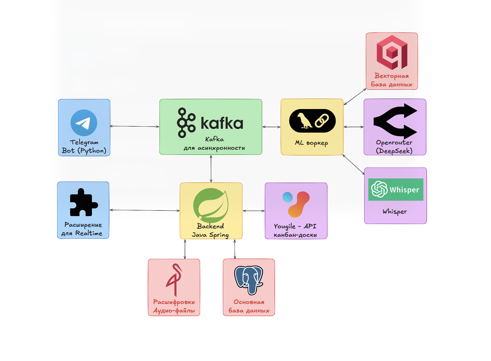

# TeamPilot — AI-ассистент проект-менеджера

> Хакатон-проект. Бот берёт на себя рутину PM: читает Telegram-чат и встречи, сам извлекает задачи, ведёт канбан в YouGile, напоминает о дедлайнах. Команда работает в привычном Telegram — минимум ручных действий.

---

## Что умеет

### Telegram → Канбан без ручного ввода

Бот присутствует в командном чате. Батчит сообщения (3 сообщения или 5 минут тишины), прогоняет через двухступенчатый LLM-пайплайн (дешёвая модель — есть ли задача? дорогая — извлечь title / assignee / deadline / column). Менеджеру приходит карточка-черновик с кнопками ✅ / ✏️ / ❌.

- Задачи с `confidence ≥ 0.90` создаются **автоматически** без подтверждения (кнопка только «Отменить»).
- В карточке — «Уверенность ИИ: XX%» из классификатора.
- Не создаёт задачу из каждого сообщения: игнорирует шутки, общие объявления без явного исполнителя.
- **Дедупликация** через семантический поиск в Qdrant — дубли не создаются.
- После подтверждения — карточка в YouGile с title, assignee, deadline, description, колонкой.

### Смена статусов из переписки

Участник пишет «беру в работу», «готово», «закрыл» — бот разбирает текст, находит нужную задачу через Qdrant и двигает карточку по канбану. Статус-изменение считается только если явно называет задачу или написано от первого лица («я сделал X», «взял X», «закончил X»).

### Инструменты просмотра задач

| Команда | Описание |
|---------|----------|
| `/mytasks` | Активные задачи текущего пользователя |
| `/tasks` | Задачи команды с фильтром по колонке канбана (динамические кнопки) |
| `/board` | Сводка доски по блокам: в работе / на проверке / просрочено (только менеджер) |
| `/tasks @username` | Задачи конкретного участника (только менеджер) |

Задачи фильтруются по колонкам (динамически из YouGile/БД) — хардкода статусов нет.

### Анализ встреч — файл

Бот принимает голосовое или запись встречи → Whisper (faster-whisper-server) → расшифровка → LLM → summary встречи + задачи с дедлайнами и ответственными → карточки в YouGile. При загрузке через бота пользователь выбирает команду через inline-кнопки.

### Анализ встреч — реалтайм (Chrome Extension)

**Chrome Extension** (WXT + React + TypeScript + Tailwind) захватывает аудио активной вкладки браузера, сохраняя звук слышимым для пользователя. Чанки по 30 секунд отправляются через STOMP/WebSocket в Spring → MinIO → Kafka → LLM Worker → Whisper. Результаты (транскрипт, summary, найденные задачи) возвращаются обратно в sidepanel в реальном времени.

**Возможности расширения:**
- Вход через Telegram: pairing-code flow (пользователь отправляет `/start <код>` боту, бот подтверждает в backend, extension получает JWT через polling).
- После входа — менеджер создаёт meeting для команды из URL звонка, бот публикует ссылку в командный чат.
- Live-подсказки прямо во время звонка: «похожая задача уже есть» (Qdrant search).
- После встречи — полный финальный транскрипт, LLM повторно анализирует весь текст и доизвлекает задачи.
- Переключение тем: тёмная / светлая / системная (Tailwind class-based dark mode, сохраняется в `chrome.storage.local`).
- Хронологический порядок лога транскрипции с автоскроллом к последнему событию.

**Разделение спикеров:** ручное сопоставление `SPEAKER_N → @username` через inline-кнопки в боте после встречи.

### Вечерний синк

В 18:00 бот пишет в чат: «Вечерний синк: напишите, что сделали сегодня». Участники описывают своё за день → LLM сопоставляет отчёты с задачами по каждой строке отдельно (per-line Qdrant search) → предлагает закрыть соответствующие карточки → менеджер получает сводку: кто отчитался / не ответил / что просрочено.

Команда `/excuse [причина]` исключает пользователя из синка на сегодня. При нескольких командах — выбор через inline-кнопки.

### Проактивные уведомления

- За ~24 часа до дедлайна — личное сообщение исполнителю (однократно, поле `deadlineNotifiedAt`).
- Stale-алерт: задача не двигалась 24+ часов.
- Учёт статусов «болею / экзамен / отпуск» через `/excuse`.
- Батчинг уведомлений: 5 отменённых задач подряд → 1 сообщение со списком.
- Уведомления — только в личку, без спама в групповой чат.

### База знаний команды (`/wiki`)

Файлы, саммари встреч и подтверждённые задачи автоматически индексируются в Qdrant коллекции `team_knowledge` (типы: `meeting_summary`, `file_summary`, `task_archive`). Команда `/wiki <запрос>` делает семантический поиск по архиву прямо из Telegram. База знаний также автоматически инжектируется как контекст при извлечении задач из новых сообщений.

### Файлы команды

После обработки файла через Whisper + LLM — title, description и summary автоматически заполняются в БД. `GET /teams/{teamId}/files` отдаёт список с presigned download URL (15 мин). В боте: кнопка «📁 Файлы» в контексте команды. Presigned URL генерируется через публичный endpoint MinIO (настраивается через `S3_PRESIGNED_ENDPOINT`).

### Геймификация и RPG-профиль (`/profile`)

- XP за выполненные задачи: 100 (вовремя) / 20 (с опозданием) / +50 (за 24ч до дедлайна).
- Множитель стрика: до 2× при ежедневной активности.
- Уровни: Новобранец → Исполнитель → Специалист → Профессионал → Эксперт → Легенда.
- Ачивки: FIRST_STEP, LIGHTNING, EARLY_BIRD, WEEK_STREAK, SNIPER, MOUNTAIN, CLEAN_MONTH.
- Push-уведомления о новом уровне и ачивках через `bots.notifications`.
- `/profile` показывает XP-прогресс-бар, стрик, статистику, inline-кнопка «Ачивки».

### Рекомендации курсов

Когда задача просрочена — Spring запускает Qdrant-поиск по семантике задачи в каталоге курсов (`team_knowledge` с `type="course"`), включая глобальный каталог (Skillbox, Яндекс Практикум, Степик, YouTube, Coursera). Исполнитель получает подборку в личку. Менеджер может добавлять курсы через URL, бот парсит og:title/og:description через jsoup. DataSeeder содержит 15+ глобальных курсов.

### RAG — контекст команды в каждом запросе к LLM

При извлечении задач из чата LLM Worker автоматически обогащает каждый запрос релевантными знаниями команды из Qdrant (`team_knowledge`): резюме встреч, summary файлов, архив задач, каталог курсов. Это позволяет LLM учитывать контекст проекта при создании задач.

Команда `/wiki запрос` делает семантический поиск по базе знаний и возвращает топ-3 релевантных фрагмента (retrieval-only, без дополнительной LLM-генерации).

### Онбординг и роли

- **SYSTEM_ADMIN**: команда `/admin` в личке, создание команд через `POST /admin/teams`, управление пользователями.
- **MANAGER**: привязка YouGile-доски, подтверждение задач, доступ к сводкам.
- **MEMBER**: просмотр задач, смена статусов, вечерний синк, курсы, профиль.

Процесс: менеджер добавляет бота в Telegram-группу → бот пишет в личку менеджеру → YouGile-токен → выбор доски → готово. Без знания команд — всё через inline-кнопки.

---

## Архитектура


> **User Flows (Activity Diagrams):** подробные пошаговые схемы всех сценариев — [docs/user-flows.md](docs/user-flows.md)

---

## Qdrant-коллекции

| Коллекция      | Содержимое                                        | Используется для                                     |
|----------------|---------------------------------------------------|------------------------------------------------------|
| `tasks`        | Векторы задач (title + description, multi-point) | Дедупликация, резолвинг статусов, live-hints         |
| `team_knowledge` | meeting_summary / file_summary / task_archive / course | /wiki поиск, контекст для LLM, рекомендации курсов |

---

## Структура репозитория

```
backend/
  monolith/              — Spring-сервис (Spring Boot 3, Java 21)
    ├─ rest/             — Controllers: Auth, Task, Team, User, Meeting, Course, Admin, YouGile...
    ├─ service/          — TaskService, GamificationService, EveningSyncService, NotificationScheduler...
    ├─ entity/           — Task, Team, TeamUser, Meeting, UserProfile, Course, YouGileSticker...
    ├─ kafka/consumer/   — LlmTaskCreate, LlmStatusChange, MeetingLiveResult, CourseRecommend...
    ├─ kafka/publisher/  — Audio, Meeting, Notification, Task, Course event publishers
    └─ config/           — WebSocket/STOMP, Kafka, YouGile, Security, DataSeeder

  core/
    web-common/          — AppException, GlobalExceptionHandler, ResponseUtils, PageResponse
    common-data/         — AbstractEntity (UUID, createdAt, updatedAt)
    kafka-common/        — KafkaSender, AbstractEventPublisher, BaseEvent, KafkaTopics
    kafka-proto-common/  — Protobuf: MessageBatch, TaskCreate, StatusChange
    security-common/     — UserPrincipal, JWT, TelegramOAuthVerifier
    logging-common/      — Structured logging (MDC, traceId)
    s3-common/           — S3Service, AbstractStoredFileEntity

llm-worker/
  main.py                — Точка входа: Kafka-consumer-потоки + Uvicorn HTTP
  processor.py           — Батчи → классификатор → параллельное извлечение задач + статусов
  sync_processor.py      — Вечерний синк: per-line Qdrant search + LLM-fallback
  api.py                 — FastAPI: GET /knowledge/search (для бота)
  llm/
    chains.py            — LangChain: classifier, task, status, audio_task, audio_status, file_summary
    prompts.py           — Все промпты (XML-теги, few-shot, CoT, calibration)
    transcript.py        — Чанкинг транскриптов с overlap
    safe_parser.py       — JSON-парсер: strip <thinking>, markdown-strip
  infra/
    qdrant.py            — multi-point store/search/delete; tasks + team_knowledge
    whisper.py           — HTTP-клиент faster-whisper-server (OpenAI SDK compatible)
    kafka.py             — Producer/consumer helpers, Protobuf deserialization
    minio.py             — Download/upload чанков встреч
    audio.py             — Конкатенация WebM-чанков для финального трека

bot/
  main.py                — Aiogram 3, регистрация роутеров
  handlers/              — setup, tasks, admin, sync (evening), profile, wiki,
  │                         courses, meetings, upload, knowledge, reminders...
  services/              — REST-клиенты: team, task, admin, user, profile, course, knowledge
  kafka/consumer.py      — bots.tasks + bots.notifications (батчинг событий по chat_id)
  keyboards/             — Inline-клавиатуры всех панелей (вложенные меню)
  states/                — FSM: setup, upload, admin, courses, sync
  storage.py             — FSM-хранилище

extension/               — Chrome Extension (Manifest V3, WXT + React + TS + Tailwind)
  entrypoints/
    popup/               — Главное меню: вход, статус записи, кнопки
    sidepanel/           — Живой лог транскрипции, задачи, summary, подсказки
    background.ts        — Service Worker: orchestrates meeting state + STOMP
    offscreen/           — Захват аудио вкладки (MediaRecorder, WebM chunking)
    content.ts           — Получение URL активной вкладки
  services/
    api.ts               — REST-клиент к Spring (auth header, base URL)
    auth.ts              — Pairing-code login, JWT storage, polling
    meetingSocket.ts     — STOMP lifecycle: connect / subscribe / send chunks / disconnect
    storage.ts           — chrome.storage.local: recording state, live events, auth
    themeSettings.ts     — Тема: system / light / dark
  hooks/
    useAuthSession.ts    — Состояние авторизации
    useRecordingState.ts — Состояние записи
    useMeetingResults.ts — Live результаты из STOMP
    useExtensionTheme.ts — Реакция на смену темы

infrastructure/
  docker/
    docker-compose.core.yml         — PostgreSQL, Redpanda (Kafka), MinIO
    docker-compose.services.yml     — вспомогательные сервисы (auth-service)
    docker-compose.ai.yml           — faster-whisper-server (порт 8002)
    docker-compose.seed.yml         — DataSeeder
  config/                — Redpanda Console
  caddy/                 — Caddyfile: reverse proxy
```

---

## Технологический стек

| Слой              | Технология                                                    |
|-------------------|---------------------------------------------------------------|
| Backend           | Java 21, Spring Boot 3, Gradle 9, WebSocket/STOMP            |
| БД                | PostgreSQL (`ddl-auto: update`)                               |
| Очередь           | Redpanda (Kafka-совместимый)                                  |
| LLM Worker        | Python 3.12, LangChain, FastAPI, Uvicorn                     |
| Векторный поиск   | Qdrant (`tasks` + `team_knowledge`)                          |
| Embeddings        | `paraphrase-multilingual-MiniLM-L12-v2` (384d, Cosine)       |
| ASR               | faster-whisper-server (OpenAI API compatible, Docker)        |
| Хранилище файлов  | MinIO (S3-совместимый)                                        |
| Контейнеризация   | Docker Compose + Jib (образы на `ghcr.io/42team-ru`)         |
| Reverse proxy     | Caddy                                                         |
| Bot               | Python, Aiogram 3, aiogram-fsm                               |
| Extension         | WXT, React, TypeScript, Tailwind, @stomp/stompjs             |
| Kanban            | YouGile API                                                   |
| Сериализация      | Protobuf (MessageBatch, TaskCreate, StatusChange)            |
| URL-парсинг       | jsoup (og:title / og:description для курсов)                 |

---

## Быстрый старт

### Требования

- Docker + Docker Compose
- `.env` на основе `.env.example`

### Запуск

```bash
# Инфраструктура (PostgreSQL, Kafka, MinIO, Qdrant, Caddy)
make core-up

# Whisper ASR (нужен для аудио и встреч)
make whisper-up

# Залить тестовые данные (глобальные курсы, seed-пользователи)
make seed
```

Spring-монолит, LLM Worker и Telegram-бот запускаются вручную:

```bash
# Spring-монолит
cd backend && ./gradlew :monolith:bootRun

# Сгенерировать Protobuf-классы (нужно один раз, перед первым запуском LLM Worker)
make proto-gen

# LLM Worker
cd llm-worker && uv run python main.py

# Telegram-бот
cd bot && uv run python main.py
```

### Сборка и публикация

```bash
make build     # jibDockerBuild локально
make push      # ghcr.io/42team-ru/*
make release   # build + push через Jib
```

### Управление

```bash
make ps        # статус контейнеров
make clean     # удалить все контейнеры и volumes
```

---

## Команды Telegram-бота

| Команда            | Кто | Описание                                                       |
|--------------------|-----|----------------------------------------------------------------|
| `/start`           | все | Регистрация, привязка к команде, главное меню с кнопками      |
| `/admin`           | ADMIN | Панель администратора: создание команд, управление          |
| `/tasks`           | все | Задачи команды по колонкам канбана                            |
| `/mytasks`         | все | Мои активные задачи                                           |
| `/board`           | MANAGER | Сводка доски команды                                      |
| `/profile`         | все | RPG-профиль: XP, уровень, стрик, ачивки                      |
| `/wiki <запрос>`   | все | Семантический поиск по базе знаний команды                    |
| `/excuse [причина]`| все | Исключить себя из вечернего синка на сегодня                  |
| `/upload`          | все | Загрузить аудио/файл в команду (с выбором команды)            |

Основные флоу доступны через кнопки — знать команды необязательно.

---

## REST API (основные группы)

| Группа                    | Пример эндпоинтов                                              |
|---------------------------|----------------------------------------------------------------|
| Auth / Telegram OAuth     | `POST /auth/telegram`, `POST /auth/register`, `GET /auth/me`  |
| Extension login (pairing) | `POST /auth/extension-login`, `GET /auth/extension-login/{code}`, `POST /auth/extension-login/{code}/confirm` |
| Teams                     | `POST /admin/teams`, `GET /teams/my`, `PATCH /teams/{id}`, `GET /teams/{id}/files` |
| YouGile                   | `POST /auth/yougile/auth`, `POST /auth/yougile/board`, `PATCH /auth/invite/{teamId}/yougile` |
| Tasks                     | `GET /tasks`, `GET /tasks/columns`, `POST /tasks/{id}/approve`, `POST /tasks/{id}/cancel` |
| Users                     | `GET /users/{telegramId}/stats`, `PATCH /users/{id}` |
| Meetings                  | `POST /meetings`, `GET /meetings/by-url` |
| Courses                   | `POST /courses/teams/{teamId}/courses`, `GET /courses/teams/{teamId}/courses` |
| Excuses                   | `POST /sync/excuse`, `GET /sync/excuse/teams` |

---