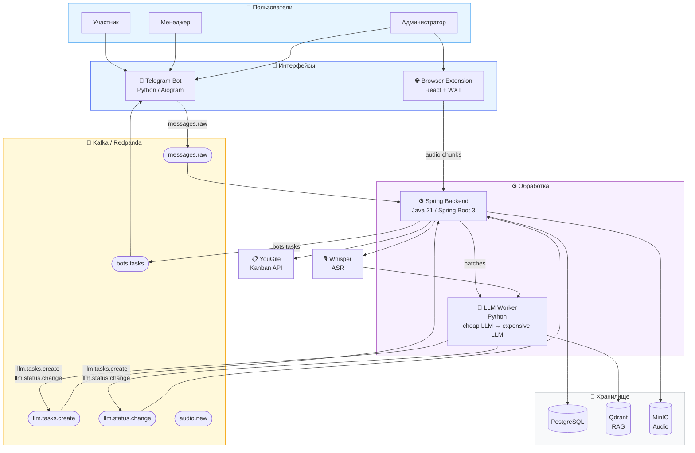
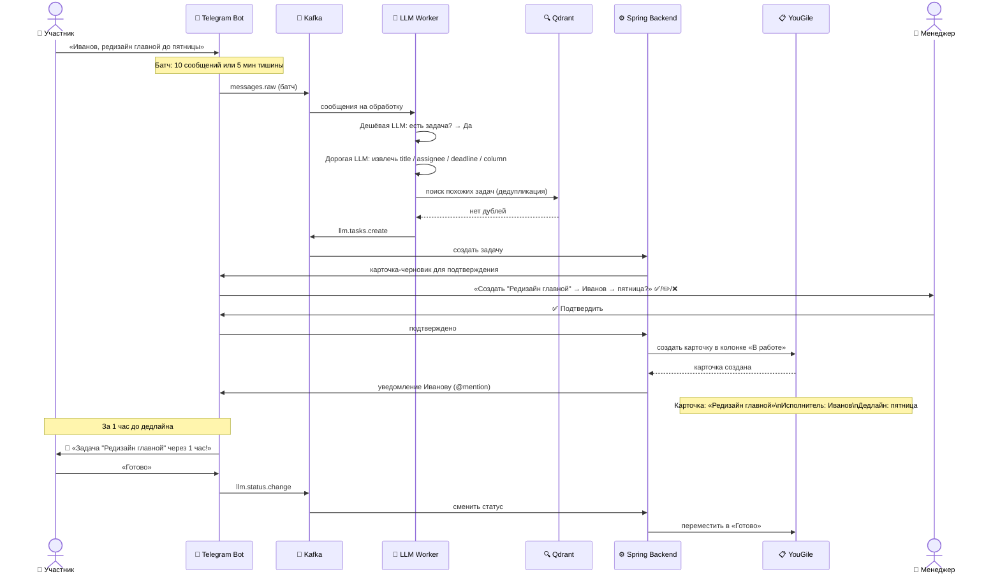

# TeamPilot — AI-ассистент проект-менеджера

---

## Диаграммы

### Архитектура системы (flowchart)



---

### Главный сценарий: Сообщение → Задача в YouGile (sequence)



---

## 1. Понимание проблемы

### Корневая проблема

Современные команды коммуницируют одновременно в нескольких каналах: Telegram-чаты, голосовые встречи (Яндекс Телемост), голосовые сообщения. Задачи рождаются именно там — в коммуникации. Но управление ими происходит в отдельной системе (канбан-доска). Между этими двумя мирами — руки project-менеджера.

**Следствие:** менеджер проекта тратит значительную часть времени не на управление, а на ручное копирование: из чата в YouGile, с совещания в таску, из устной договорённости в карточку с дедлайном.

### Конкретные боли (зафиксированы в интервью с кейсодержателем — Егором Орлом, Сколково)

- Договорённости с Яндекс Телемоста теряются — никто не ведёт протокол
- Участники забывают обновлять статус задач → канбан неактуален
- Вечерний синк занимает время: каждый вручную отчитывается, менеджер вручную двигает карточки
- При масштабировании на несколько чатов / команд нагрузка на PM кратно растёт
- Отсутствие проактивных напоминаний → задачи уходят в просрочку

### Ограничения трека

- Основной канал — **Telegram** (выбор кейсодержателя, MAX-бот недоступен физлицам)
- Канбан — **YouGile** (у Trello ограничения по аккаунтам)
- Встречи — приоритет **Яндекс Телемост**
- Стек и API — любые, бюджет на модели — команды несут сами
- Срок — 3–4 дня, значит нужен рабочий прототип, а не концепт

---

## 2. Целевая аудитория и ценность

### Кто использует

| Роль | Кто это | Что получает с TeamPilot |
|------|---------|--------------------------|
| **Менеджер команды** | Тимлид, PM, руководитель проекта | Задачи создаются автоматически из чата. Вечерний синк — бот сам двигает карточки. Экономия: ~2–3 часа в день |
| **Участник команды** | Разработчик, дизайнер, аналитик | Личные напоминания в Telegram за 1 час до дедлайна. Не нужно помнить — бот напомнит. Статус обновляется одним сообщением «готово» |
| **Системный администратор** | IT-администратор организации | Централизованное управление командами, интеграциями и пользователями через бота |
| **Руководитель** | Директор проектного офиса, госслужащий | Вечерний дайджест: кто что сделал, кто не отчитался, что просрочено — без звонков |

### Сегменты рынка

1. **IT и продуктовые команды** — основная аудитория, максимальная частота встреч и задач
2. **Проектные офисы и административные подразделения** — нужна структурированность, минимум ручного управления
3. **Государственные организации** — контролируемая среда, важна автономность и безопасность данных

### Уникальная ценность

TeamPilot не создаёт новую платформу — он **встраивается в уже существующий рабочий процесс**. Пользователи продолжают писать в Telegram как обычно. Бот работает в фоне, не требуя переключения контекста.

---

## 3. Концепция решения

### Как это работает — главный сценарий

```
Участник пишет в чат: «Иванов, сделай редизайн до пятницы»
         ↓
Бот молча накапливает сообщения батчами (10 сообщений или 5 мин тишины)
         ↓
Дешёвая LLM: есть ли здесь задача? → да
         ↓
Дорогая LLM: извлечь title, исполнитель, дедлайн, описание, колонку в YouGile
         ↓
Проверка дедупликации (RAG / Qdrant)
         ↓
Менеджеру: «Создать задачу "Редизайн главной" → Иванов → пятница?» [✅/✏️/❌]
         ↓
Задача создана в YouGile, Иванов получает @-уведомление
         ↓
За 1 час до дедлайна — напоминание Иванову
Иванов пишет «готово» → карточка переехала в «Готово»
```

### Архитектурные решения и их обоснование

**Telegram-бот, а не веб-приложение**
Кейсодержатель прямо назвал Telegram основным каналом команды. Встраивание в существующий инструмент снижает порог входа до нуля — не нужно регистрироваться на новой платформе.

**Браузерное расширение для встреч, а не бот-участник**
Мы рассмотрели три варианта:
- Бот-участник (Playwright) — при 100+ пользователях требует сотни экземпляров браузера, нереализуемо
- Десктопное приложение — разные ОС, сложный деплой, долгое внедрение
- **Браузерное расширение** — кроссплатформенное, получает аудиопоток на стороне клиента, масштабируется без серверных затрат

**YouGile как канбан**
Выбран по требованию кейсодержателя. У Trello — ограничения по числу аккаунтов. YouGile даёт полноценный API для создания и перемещения карточек.

**Двухуровневая LLM-обработка**
- Дешёвая модель (фильтрация): «есть ли задача?» — экономит 80% затрат на токены
- Дорогая модель (извлечение): только для подтверждённых случаев — высокое качество там, где важно

**RAG на Qdrant**
Позволяет дедуплицировать задачи и учитывать терминологию команды при извлечении. Задача «сделай лендос» и «доделай landing page» не создадут две карточки.

---

## 4. MVP — что делаем за хакатон

### Этап 1 (MVP, 3–4 дня) — критерий готовности демо

| Функционал | Критерий «сделано» |
|------------|-------------------|
| Telegram-бот, авторизация | Пользователь логинится, роли работают |
| Анализ чата → задача в YouGile | Сообщение → карточка за **< 30 сек** |
| Загрузка аудио → summary + задачи | MP3/WAV загружен → задачи извлечены |
| Напоминания о дедлайнах | Уведомление приходит за 1 час до срока |
| Вечерний дайджест | В 18:00 каждый получает список своих задач |
| Подтверждение задач (✅/✏️/❌) | Кнопки работают, карточка создаётся/редактируется/отменяется |

**Явно вне scope MVP:**
- Браузерное расширение (→ Этап 2)
- Real-time анализ встреч (→ Этап 2)
- Геймификация, рекомендации по развитию (→ Этап 2)
- Трекинг скорости/качества (→ Этап 2)

### Этап 2 (расширение после хакатона)

- Браузерное расширение + захват аудиопотока Телемоста в реальном времени
- Real-time summary и задачи во время звонка
- База знаний команды (RAG с историей решений)
- Автоматическое назначение исполнителей по истории
- Геймификация (ачивки, уровни, очки)

---

## 5. Технологический стек

| Слой | Технологии | Почему |
|------|-----------|--------|
| Telegram Bot | Python, Aiogram | Нативный стек для Telegram-ботов, быстро |
| Backend | Java 21, Spring Boot 3 | Надёжность, Kafka-интеграция, команда знает |
| LLM | Claude / GPT-4o | Высокое качество извлечения задач |
| ASR | Whisper (локально) | Бесплатно, работает без внешних зависимостей |
| Векторная БД | Qdrant | RAG для дедупликации и контекста команды |
| Очередь | Kafka / Redpanda | Асинхронная обработка батчей сообщений |
| Файловое хранилище | MinIO (S3-совместимый) | Аудиофайлы встреч |
| Браузерное расширение (этап 2) | React + WXT | Кроссплатформенное, поддерживает Chrome/Firefox |

---

## 6. Текущий прогресс реализации

### Что работает end-to-end прямо сейчас

**1. Сообщение в Telegram → задача в YouGile**
Участник пишет в рабочий чат. Бот накапливает батч (10 сообщений или 5 минут тишины), отправляет в Kafka. LLM Worker фильтрует дешёвой моделью («есть задача?»), извлекает атрибуты дорогой (title, assignee, deadline). Qdrant проверяет дубли. Менеджер получает карточку-черновик с кнопками ✅/✏️/❌. После подтверждения — задача появляется в YouGile.

**2. Загрузка аудио → задачи и summary встречи**
Участник загружает аудиофайл через `/upload` или прикрепляет медиа в чате. Файл уходит в MinIO, событие — в Kafka. Whisper расшифровывает запись в текст. LLM Worker чанкует транскрипт, извлекает задачи с исполнителями и дедлайнами. Менеджер подтверждает — задачи создаются в YouGile.

**3. Напоминания о дедлайнах**
Spring-планировщик проверяет дедлайны. За 1 час до срока исполнитель получает личное сообщение в Telegram с названием задачи и дедлайном.

**4. Вечерний дайджест**
В 18:00 каждый участник получает список своих задач на текущий день из YouGile. Кто не обновил статус — получает отдельное напоминание.

**5. Смена статуса задачи**
Участник пишет «готово» или нажимает кнопку статуса в боте → Kafka → Spring → карточка переезжает в соответствующую колонку YouGile.

**6. Ролевая модель и онбординг**
Системный администратор управляет командами и пользователями. Менеджер создаёт команду, вводит YouGile login/company/board прямо в боте (FSM-диалог), получает invite-ссылку для участников. Участник проходит регистрацию по ссылке за 30 секунд.

**7. Личный кабинет и просмотр задач**
Команды `/mytasks`, `/board`, `/tasks` показывают актуальные задачи из YouGile с пагинацией, дедлайнами и фильтрами. Работает и в личных сообщениях, и как ответ на вопрос «какие у меня задачи» в свободной форме.

---

## 7. Ролевая модель и безопасность

### Роли в системе

| Роль | Права |
|------|-------|
| Системный администратор | Управление командами и пользователями, глобальные настройки |
| Менеджер команды | Создание команды, подключение YouGile, управление участниками, подтверждение задач |
| Участник команды | Просмотр своих задач, обновление статусов, загрузка аудио |

### Безопасность и конфиденциальность

- Данные команды обрабатываются через внешние LLM API — команда это осознаёт (зафиксировано в требованиях кейсодержателя)
- После хакатона: возможна замена облачных моделей на локальные (Ollama + открытые модели)
- Архитектура не содержит хранения токенов в открытом виде

---

## 8. Пользовательские сценарии (User Journeys)

### Сценарий 1: Задача из чата (основной)

1. Участник пишет: «Иванов, сделай редизайн главной до пятницы»
2. Бот читает чат, накапливает батч (10 сообщений / 5 мин)
3. LLM извлекает: title=«Редизайн главной», assignee=Иванов, deadline=пятница
4. Менеджеру: «Создать задачу?» + кнопки ✅/✏️/❌
5. Нажал ✅ → карточка в YouGile, Иванов получает уведомление
6. За 1 час до пятницы — напоминание Иванову
7. Иванов пишет «готово» → карточка в «Готово»

**Результат:** договорённость → отслеживаемая задача без ручного переноса

### Сценарий 2: Задача из аудиофайла встречи

1. Менеджер загружает запись встречи в бота
2. Whisper расшифровывает аудио в текст
3. LLM формирует summary + извлекает задачи с исполнителями и дедлайнами
4. Менеджер подтверждает найденные задачи
5. Задачи создаются в YouGile

**Результат:** встреча превращается в карточки без ручного протокола

### Сценарий 3: Вечерний дайджест

1. В 18:00 бот запрашивает статусы задач из YouGile
2. Каждый участник получает персональный список: «Твои задачи на сегодня: ...»
3. Участники, не обновившие статус, получают отдельное напоминание
4. Менеджер получает сводку: кто отчитался, что просрочено

---

## 9. Почему TeamPilot выиграет

| Критерий кейсодержателя | Что делает TeamPilot |
|--------------------------|----------------------|
| Telegram → задача на канбане | ✅ Автоматически, < 30 сек |
| Встречи → задачи | ✅ Через загрузку аудио (MVP) и расширение (этап 2) |
| Проактивные напоминания | ✅ За 1 час до дедлайна + вечерний дайджест |
| Минимум ручного управления | ✅ Только подтверждения, всё остальное — бот |
| YouGile интеграция | ✅ Создание, перемещение, синхронизация карточек |
| Вечерний синк | ✅ Автоматически в 18:00 |
| Ролевая модель | ✅ Админ / Менеджер / Участник |
| Масштабируемость | ✅ Kafka + Spring, браузерное расширение без серверных ботов |
