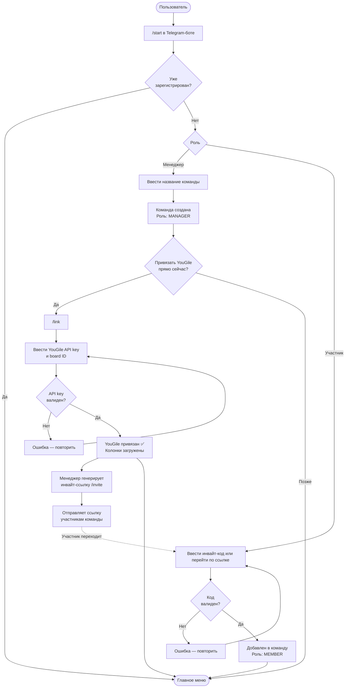
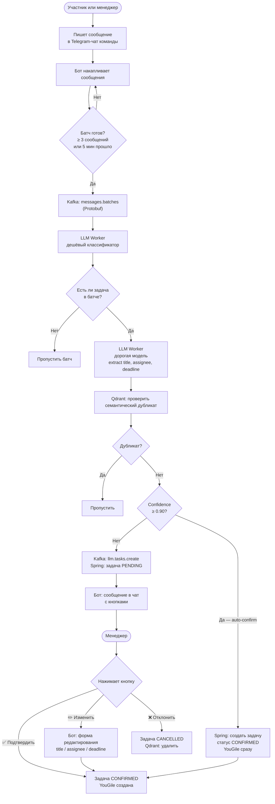
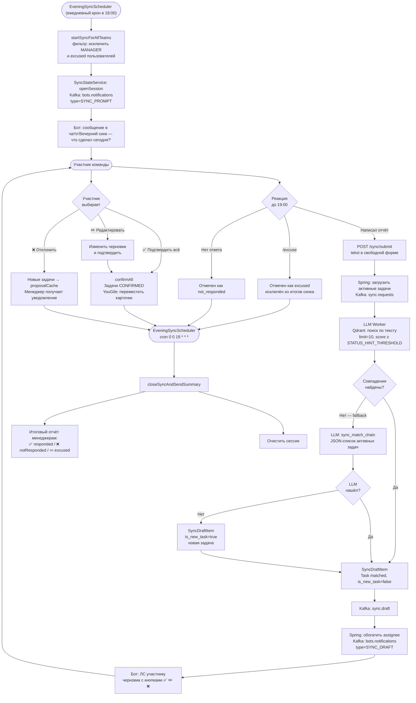
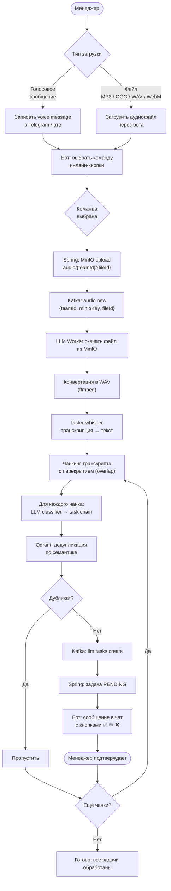
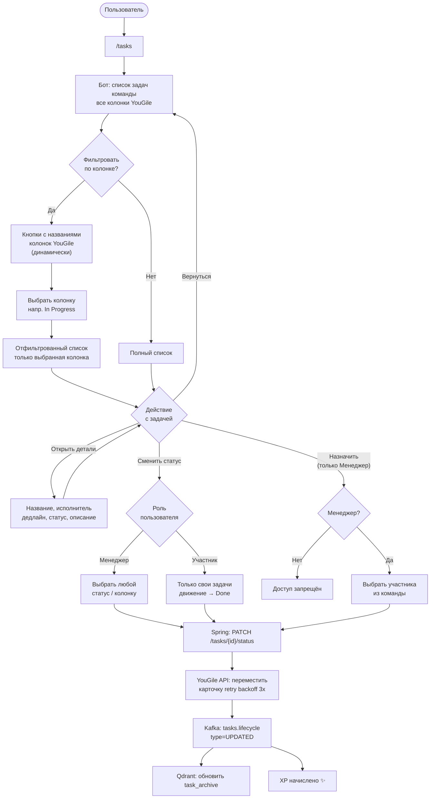
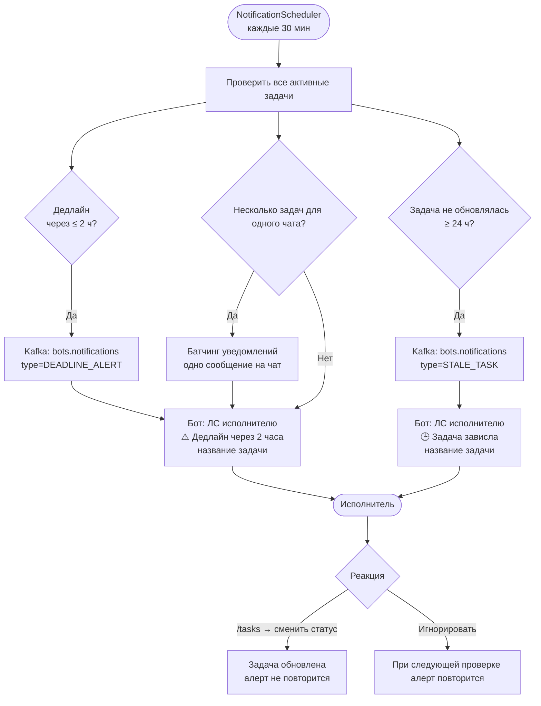
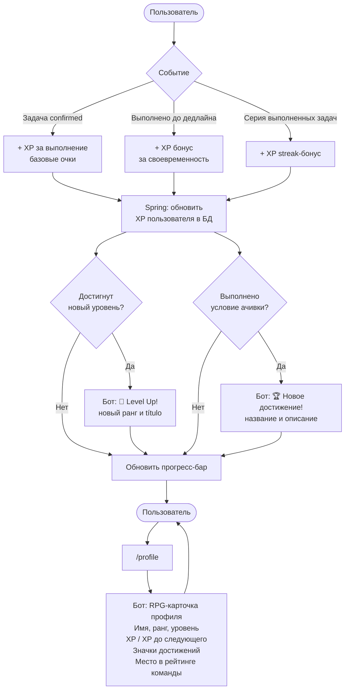
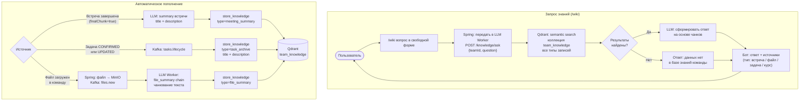

# TeamPilot — User Flows

Activity-диаграммы для всех ключевых пользовательских сценариев.
Sequence-диаграммы с деталями системного взаимодействия — в [README.md](../README.md).

---

## Содержание

1. [Онбординг — регистрация и создание команды](#1-онбординг)
2. [Чат → Задачи в YouGile](#2-чат--задачи)
3. [Chrome Extension — реалтайм-встреча](#3-chrome-extension--встреча)
4. [Вечерний синк](#4-вечерний-синк)
5. [Аудио-встреча через бота](#5-аудио-встреча)
6. [Управление задачами](#6-управление-задачами)
7. [Дедлайн-уведомления и стейл-алерты](#7-уведомления)
8. [Геймификация и профиль](#8-геймификация)
9. [Рекомендации курсов](#9-рекомендации-курсов)
10. [База знаний (`/wiki`)](#10-база-знаний)

---

## 1. Онбординг

Регистрация пользователя, создание или вступление в команду, привязка YouGile.

---

## 2. Чат → Задачи

Автоматическое извлечение задач из переписки в Telegram-чате команды.

---

## 3. Chrome Extension — Встреча

Запись и транскрипция встречи в браузере с real-time созданием задач.

```mermaid
flowchart TD
    Start([Пользователь]) --> A["Открывает popup\nChrome Extension"]
    A --> B{Авторизован?}

    B -->|Нет| C["Нажать Login"]
    C --> D["Бэкенд: POST /auth/extension-login\nВозвращает 6-значный код"]
    D --> E["Popup показывает код"]
    E --> F["Пользователь отправляет\n/start КОД в Telegram-бот"]
    F --> G["Бот подтверждает сессию\nна бэкенде"]
    G --> H["Extension опрашивает\nGET /auth/extension-login/{код}"]
    H --> I{Подтверждено?}
    I -->|Нет — ждёт| H
    I -->|Да| J["JWT сохранён\nв chrome.storage.local ✅"]
    B -->|Да| J

    J --> K["Открыть нужную вкладку\nвстреча, звонок, конференция"]
    K --> L["Нажать Record в popup"]
    L --> M["Spring: GET /meetings/by-url\nили POST /meetings создать встречу"]
    M --> N["STOMP подключение\nAuthorization: Bearer token"]
    N --> O["Подписка на\n/topic/meetings/{id}/results"]
    O --> P["chrome.tabCapture + getUserMedia\nзахват вкладки и микрофона"]
    P --> Q["AudioContext: микс\nвкладка + микрофон"]

    Q --> R["Цикл каждые 30 сек"]
    R --> S["MediaRecorder → WebM blob\nfixWebmDuration"]
    S --> T["STOMP SEND\n/app/meetings/{id}/chunks\naudioBase64, chunkIndex"]
    T --> U["Spring → MinIO\nmeetings/{id}/chunks/{N:06d}"]
    U --> V["Kafka: meetings.audio.chunks"]
    V --> W["LLM Worker: Whisper\nтранскрипция чанка"]
    W --> X["Накопление контекста\nклассификатор → задачи"]
    X --> Y["Qdrant hints\nscore ≥ 0.80"]
    Y --> Z["Kafka: meetings.live.result"]
    Z --> AA["STOMP broadcast\n/topic/meetings/{id}/results"]
    AA --> AB["Sidepanel обновляется\nтранскрипция + подсказки"]
    AB --> AC{Продолжить\nзапись?}
    AC -->|Да| R
    AC -->|Нет — Stop| AD["Финальный чанк\nfinalChunk=true\n250 мс"]

    AD --> AE["LLM Worker: финализация"]
    AE --> AF["Скачать все чанки MinIO\nобъединить merge_audio_chunks"]
    AF --> AG["Whisper: полная\nтранскрипция встречи"]
    AG --> AH["LLM: title, description,\nsummary встречи"]
    AH --> AI["Qdrant: store_knowledge\ntype=meeting_summary"]
    AI --> AJ["Повторное извлечение задач\nиз полного транскрипта"]
    AJ --> AK["STOMP: финальный результат\nfinalResult=true"]
    AK --> AL["Sidepanel: итог встречи\nзадачи + резюме"]
    AL --> AM([Менеджер подтверждает задачи])
```

---

## 4. Вечерний синк

Ежедневный статус-чек команды в 18:00, автоматическое закрытие задач.

---

## 5. Аудио-встреча

Загрузка записи встречи через Telegram-бота для автоматической транскрипции.

---

## 6. Управление задачами

Просмотр, фильтрация и обновление задач через Telegram-бота.

---

## 7. Уведомления

Автоматические алерты о дедлайнах и застрявших задачах.

---

## 8. Геймификация

Начисление XP, уровни, достижения и просмотр RPG-профиля.

---

## 9. Рекомендации курсов

Менеджер добавляет курсы, система автоматически рекомендует их при просроченных задачах.

```mermaid
flowchart TD
    subgraph "Добавление курса (Менеджер)"
        MA([Менеджер]) --> A["POST /teams/{id}/courses\nURL курса"]
        A --> B["Spring: jsoup → og:title\nog:description, og:image"]
        B --> C{Парсинг\nуспешен?}
        C -->|Нет| D["Ошибка — ввести вручную\ntitle + description"]
        D --> E["Курс сохранён\nscope = TEAM или GLOBAL"]
        C -->|Да| E
        E --> F["Kafka: courses.indexed\n{courseId, teamId, title, description}"]
        F --> G["LLM Worker: store_knowledge\ntype=course, Qdrant"]
        G --> H["Курс готов к рекомендациям ✅"]
    end

    subgraph "Автоматическая рекомендация"
        Sched(["NotificationScheduler\nкаждые 30 мин"]) --> I["Задачи с истёкшим дедлайном\nbez courseRecommendedAt"]
        I --> J["Kafka: courses.recommend.request\ntaskTitle + taskDescription"]
        J --> K["LLM Worker: semantic search\nQdrant team_knowledge\ntype=course\nteam + GLOBAL каталог, limit=5"]
        K --> L{Курсы\nнайдены?}
        L -->|Нет| M["Нет рекомендаций"]
        L -->|Да| N["Kafka: courses.recommend.result\ntop-5 course_ids"]
        N --> O["Spring: courseRecommendedAt = now\nбот: ЛС исполнителю"]
        O --> P([Исполнитель])
        P --> Q["📚 Подборка курсов\nпо теме просроченной задачи"]
        Q --> R{Действие}
        R -->|Открыть| S["Ссылка на ресурс\nSkillbox / Stepik / YouTube / etc."]
        R -->|Игнорировать| T["Повтор не предусмотрен\ncourseRecommendedAt установлен"]
    end
```

---

## 10. База знаний

Автоматическое накопление знаний команды и ответы на вопросы через `/wiki`.

